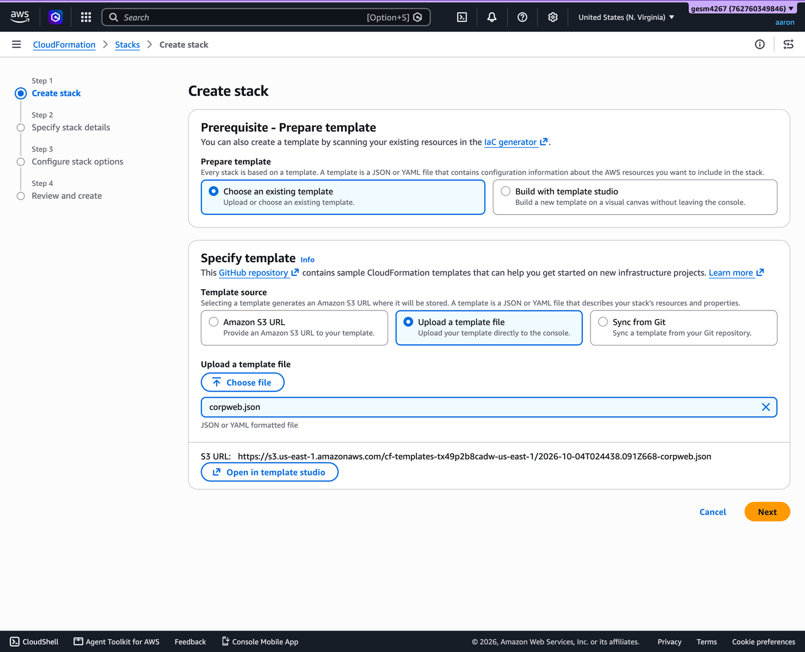
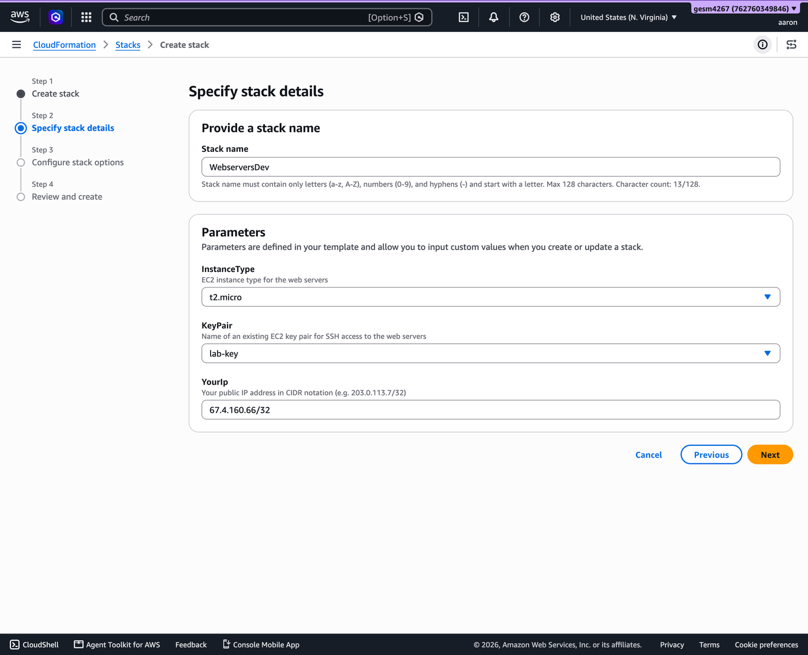
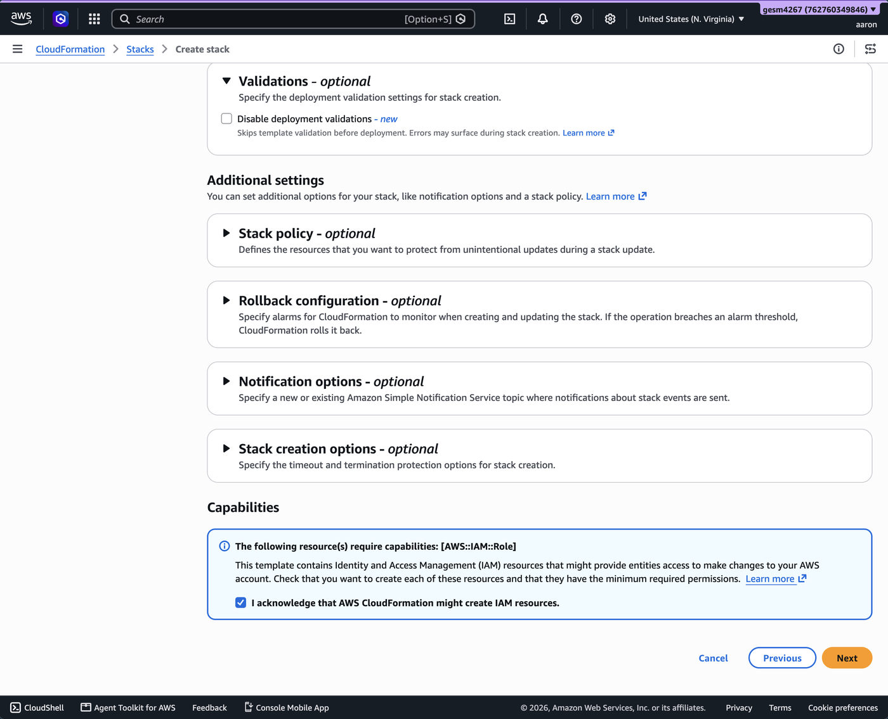
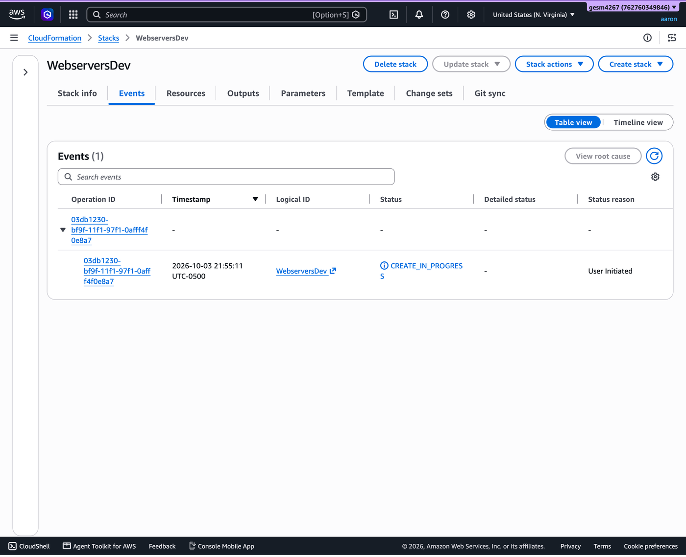
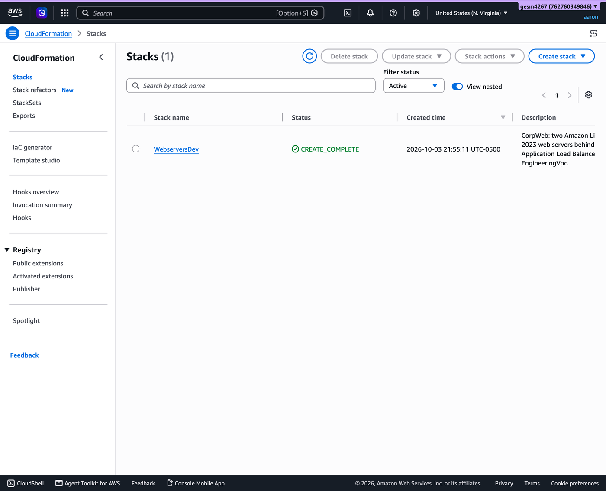
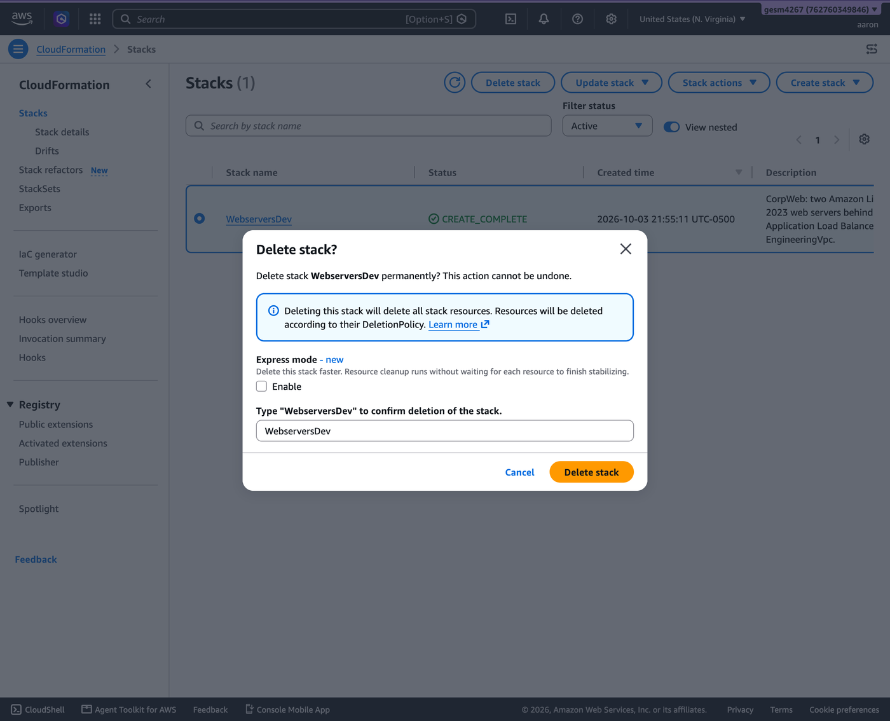

# CorpWeb CloudFormation Stack

SEIS 616 CloudFormation homework. `corpweb.json` creates a VPC with two public subnets, two Amazon Linux 2023 web servers (`web1` and `web2`), and an Application Load Balancer (`EngineeringLB`) in front of them.

Each step below can be done in the **AWS console** (in your browser) or with the **AWS CLI** (in a terminal). Pick one.

## 1. Run the template

You need an existing EC2 key pair in us-east-1.

### Fill in the values

| Value          | Where to find it                                                                                                                                                                                                        |
| -------------- | ----------------------------------------------------------------------------------------------------------------------------------------------------------------------------------------------------------------------- |
| `InstanceType` | Use `t2.micro` or `t2.small`. Any other value is rejected.                                                                                                                                                              |
| `KeyPair`      | The **name** of a key pair in us-east-1, not the `.pem` file. Find it in the EC2 console under **Network & Security → Key Pairs**, or run `aws ec2 describe-key-pairs --region us-east-1 --query "KeyPairs[].KeyName"`. |
| `YourIp`       | Your public IP address. Search "what is my ip" or run `curl https://checkip.amazonaws.com`. Add `/32` to the end, for example `203.0.113.7/32`.                                                                         |

### Option A: AWS console

1. Sign in to the AWS console and set the region to **US East (N. Virginia) us-east-1** in the top right.
2. Open **CloudFormation** and click **Create stack → With new resources (standard)**.
3. Choose **Upload a template file**, select `corpweb.json`, and click **Next**.

   

4. Enter `WebserversDev` as the stack name, fill in `InstanceType`, `KeyPair`, and `YourIp`, and click **Next**.

   

5. On the next page, leave the settings as they are. At the bottom, check **I acknowledge that AWS CloudFormation might create IAM resources** and click **Next**.

   

6. Review the summary and click **Submit**.
7. The stack starts as **CREATE_IN_PROGRESS**. Click the refresh button until it shows **CREATE_COMPLETE** (about 3 to 5 minutes).

   

   

### Option B: AWS CLI

Run this from this repo's folder so `file://corpweb.json` can find the template. If you use a named AWS CLI profile, add `--profile <profile-name>` to every command.

```bash
aws cloudformation create-stack \
  --region us-east-1 \
  --stack-name WebserversDev \
  --template-body file://corpweb.json \
  --capabilities CAPABILITY_IAM \
  --parameters \
    ParameterKey=InstanceType,ParameterValue=t2.micro \
    ParameterKey=KeyPair,ParameterValue=<your-key-pair> \
    ParameterKey=YourIp,ParameterValue=<your-ip>/32
```

Wait for the stack to finish (about 3 to 5 minutes):

```bash
aws cloudformation wait stack-create-complete --region us-east-1 --stack-name WebserversDev
```

`CAPABILITY_IAM` (the checkbox in step 5 of the console option) is needed because the template creates a small IAM role. The role lets the servers copy `index.php` from S3 when they start.

## 2. Verify it worked

### Open the website

Get the load balancer address from the stack's `WebUrl` output:

- **Console:** In CloudFormation, select `WebserversDev` and open the **Outputs** tab.
- **CLI:**

  ```bash
  aws cloudformation describe-stacks --region us-east-1 --stack-name WebserversDev \
    --query "Stacks[0].Outputs[0].OutputValue" --output text
  ```

Open that address in a browser. The page says `Hi, I'm instance i-...`. Refresh a few times and the instance ID changes between the two servers, which shows the load balancer is sending traffic to both.


### SSH into a server (optional)

Get the servers' public IP addresses:

- **Console:** Open **EC2 → Instances**, select `web1` or `web2`, and copy the **Public IPv4 address**.
- **CLI:**

  ```bash
  aws ec2 describe-instances --region us-east-1 \
    --filters Name=tag:aws:cloudformation:stack-name,Values=WebserversDev Name=instance-state-name,Values=running \
    --query "Reservations[].Instances[].[Tags[?Key=='Name']|[0].Value,PublicIpAddress]" --output text
  ```

  This prints one line per server, for example:

  ```
  web1    18.209.240.62
  web2    44.204.238.8
  ```

Then connect from a terminal with your key pair's `.pem` file and one of those IPs. Type `yes` if SSH asks to confirm the host the first time.

```bash
ssh -i <path-to-your-key>.pem ec2-user@<server-public-ip>
```

## 3. Tear it down

Delete the stack so nothing keeps running. This removes everything the template created.

### Option A: AWS console

1. In CloudFormation, select `WebserversDev` and click **Delete stack**. In the dialog, leave **Express mode** unchecked, type `WebserversDev` to confirm, and click **Delete stack**.

   

2. Wait until the stack disappears from the list (about 2 minutes). To confirm, change the filter to **Deleted** and check that `WebserversDev` shows **DELETE_COMPLETE**.

### Option B: AWS CLI

```bash
aws cloudformation delete-stack --region us-east-1 --stack-name WebserversDev
aws cloudformation wait stack-delete-complete --region us-east-1 --stack-name WebserversDev
```

The second command finishes with no output once everything is deleted.

## How I verified it

I launched `corpweb.json` as `WebserversDev` in us-east-1, once with the console (screenshots above) and once with the CLI.

- **Stack created:** The stack reached **CREATE_COMPLETE** with no errors.
- **Load balancing:** Opening the `WebUrl` in a browser showed `Hi, I'm instance i-...`. Refreshing switched between the two instance IDs (`i-0064f5f57484ddcf5` and `i-05641f09330fa6743`), so the load balancer sent traffic to both servers.
- **SSH:** In an earlier test run of the same template, I connected to both servers with my key pair and confirmed Apache was running.
- **Teardown:** I deleted both stacks and confirmed they show **DELETE_COMPLETE**, with no instances left running.
